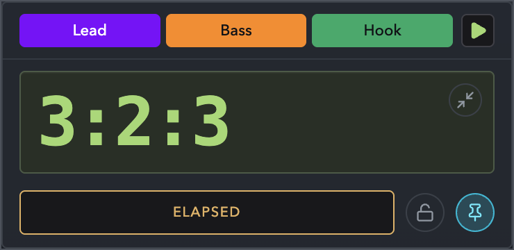
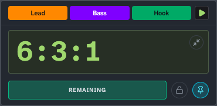

# Ableton HUD

A desktop HUD for Ableton Live that shows clip timing (`Bar:Beat:16th`) in a compact always-on-top window.

> Release builds are currently unsigned. macOS may require Finder `Control-click -> Open`, and Windows may show a SmartScreen warning before launch.

## What You Get

- Fast musical counter in `Bar:Beat:16th`
- `Elapsed` and `Remaining` timing modes
- Last-bar visual warning behavior
- Beat flash with downbeat emphasis
- Clip, track, and scene chips with Live colors
- Floating/normal window toggle
- Track lock toggle
- Compact mode for counter-only view
- Persisted window position, size, mode, and UI preferences

## Screenshots





## Quick Start (Release Consumer)

1. Download the latest release assets for your platform from GitHub Releases:

- `Ableton-HUD-vX.Y.Z-mac-universal.zip`
- `Ableton-HUD-vX.Y.Z-mac-universal.zip.sha256`
- `Ableton-HUD-vX.Y.Z-windows-x64-installer.exe`
- `Ableton-HUD-vX.Y.Z-windows-x64-installer.exe.sha256`

2. Verify the checksum for the asset you downloaded:

```bash
shasum -a 256 -c Ableton-HUD-vX.Y.Z-mac-universal.zip.sha256
```

PowerShell example:

```powershell
Get-FileHash .\Ableton-HUD-vX.Y.Z-windows-x64-installer.exe -Algorithm SHA256
Get-Content .\Ableton-HUD-vX.Y.Z-windows-x64-installer.exe.sha256
```

3. Open the release artifact for your platform:

- macOS: unzip the archive, then launch `Ableton HUD.app`
- Windows: run `Ableton-HUD-vX.Y.Z-windows-x64-installer.exe`, then launch `Ableton HUD`

4. In Ableton Live, install/run the `ableton-live` Max device so the HUD can connect.

Expected behavior:

- Connected + transport running: counter advances and chips populate.
- Disconnected transport: HUD stays up with disconnected status.

## Ableton / Transport Prerequisites

- Ableton Live running
- `ableton-live` Max device installed and active
- Default bridge endpoint: `ws://127.0.0.1:9001/ableton-live`

Optional overrides:

- `AOSC_LIVE_HOST` (default `127.0.0.1`)
- `AOSC_LIVE_PORT` (default `9001`)

## Controls

- `Elapsed` / `Remaining`: switch counter direction
- `FLOAT` / `NORMAL`: toggle always-on-top behavior
- `UNLOCKED` / `LOCKED`: follow selected track or keep current track pinned
- `COLLAPSE DETAILS` / `EXPAND DETAILS`: switch full vs compact layout

## Troubleshooting

| Symptom                                | What to check                                                                                                                                       |
| -------------------------------------- | --------------------------------------------------------------------------------------------------------------------------------------------------- |
| Counter stays `0:0:0`                  | Confirm Ableton Live transport is running and `ableton-live` device is connected on the same host/port as HUD.                                      |
| Status shows disconnected              | Verify Live + device are running and endpoint is reachable at `AOSC_LIVE_HOST:AOSC_LIVE_PORT`.                                                      |
| Scene chip with no color appears black | Current behavior should render no-color scene as unfilled/outline style; update to latest build if you still see black fill.                        |
| App opens in compact mode unexpectedly | Preferences are persisted. Toggle `EXPAND DETAILS` once; next launch should keep the chosen mode.                                                   |
| Debug port conflict in dev debug mode  | `pnpm run dev:debug` auto-selects the next free ports from `AOSC_MAIN_DEBUG_PORT` (default `9230`) and `AOSC_RENDERER_DEBUG_PORT` (default `9222`). |

## Developer Workflow

Requirements:

- Node.js 22+
- pnpm 10+
- macOS for Electron/macOS packaging workflows

Install:

```bash
pnpm install
```

Run app in dev:

```bash
pnpm run dev
```

Run app in debug dev mode (auto-select free inspector/CDP ports):

```bash
pnpm run dev:debug
```

Lint:

```bash
pnpm run lint
pnpm run lint:fix
```

Validate:

```bash
pre-commit run --all-files
pnpm run lint
pnpm test
pnpm run typecheck
pnpm run build
pnpm run test:e2e
```

`pre-commit run --all-files` now includes the docs validator, `tsc --noEmit`,
`pnpm run lint:fix`, and `pnpm test`. The CI lint job skips that test hook via
`SKIP` because the dedicated `test` workflow already covers it. `pnpm run lint`
is the strict zero-warning check, while `pnpm run lint:fix` is the mechanical
cleanup entry point used by pre-commit. `pnpm test` now shuffles file order and
intra-file test order on every run and logs the shuffle seed at startup; rerun
with `VITEST_SEQUENCE_SEED=<seed> pnpm test` to reproduce an order-dependent
failure. Run `pnpm run test:e2e` manually or rely on the dedicated CI job when
you need Electron end-to-end coverage. The lint gate also enforces authored
JSDoc on class declarations and expressions, function declarations and
expressions, method definitions, arrow functions, TypeScript interfaces and
their members/signatures, and TypeScript type declarations. Start with
`pnpm run lint:fix`, then write the missing docs that autofix cannot
synthesize. The CI E2E job also captures HUD screenshots and uploads them,
along with the Playwright HTML report, as workflow artifacts on every run so
Windows and macOS executions can be inspected visually. Those artifacts now
include stable smoke renders for the known HUD states: playing, stopped,
disconnected, remaining, and compact. On successful `main` pushes, the E2E
workflow uploads mergeable Windows/macOS blob reports, merges them into a
single Playwright HTML report, and publishes that report to the repo GitHub
Pages site. GitHub Pages must use `GitHub Actions` as the publishing source
for that deployment path. The merged report now uses plain platform project names so
Windows and macOS results do not collapse into a single anonymous list. It
also rejects `Reflect`; use explicit property access, assignment, or a typed
adapter instead.

Build local macOS app directory:

```bash
pnpm run dist:mac
```

Output example: `dist/mac-universal/Ableton HUD.app`

## Harness Docs

This repo now keeps agent-facing source of truth in versioned files:

- `ARCHITECTURE.md`
- `docs/QUALITY.md`
- `docs/product-specs/`
- `docs/exec-plans/`

The docs lint runs as a pre-commit hook locally and through the existing CI
`Lint` job's `pre-commit run --all-files`.

## Releases

Tag and push to trigger the release workflow:

```bash
git tag -a v0.1.0 -m "v0.1.0"
git push origin v0.1.0
```

CI workflow behavior:

- `ci.yml` runs on pull requests, `main`, and `v*` tags
- `ci.yml` uses the shared [setup-ci](/Users/rob/Developer/aosc/.github/actions/setup-ci/action.yml)
  composite action for the repeated Node/pnpm dependency bootstrap
- `Lint` runs `pre-commit run --all-files` on macOS and Windows
- `Test` runs `pnpm test` on macOS and Windows
- `E2E` runs `pnpm run test:e2e` on macOS and Windows
- `E2E` uploads HUD screenshots plus the Playwright HTML report as workflow
  artifacts on every run
- Those E2E artifacts include stable smoke renders for the known HUD states:
  playing, stopped, disconnected, remaining, and compact
- On successful `main` pushes, the downstream `Build Playwright Report` and
  `Deploy GitHub Pages` jobs merge the Windows/macOS blob reports and publish
  that HTML report to the repo GitHub Pages site
- `Build` runs release validation builds on macOS and Windows for pull
  requests, `main`, and `v*` tags
- On `v*` tags, `Build` stages the published macOS zip and Windows installer,
  plus checksums, as same-run workflow artifacts
- Those tagged release archives are assembled by
  [package-release-macos.sh](/Users/rob/Developer/aosc/scripts/package-release-macos.sh)
  and
  [package-release-windows.ps1](/Users/rob/Developer/aosc/scripts/package-release-windows.ps1)
- `Release` runs only on `v*` tags
- `Release` waits on successful `Lint`, `Test`, `E2E`, and `Build` jobs, then
  publishes the staged macOS and Windows artifacts as the immutable GitHub
  Release
- Publishes:
  - `Ableton-HUD-vX.Y.Z-mac-universal.zip`
  - `Ableton-HUD-vX.Y.Z-mac-universal.zip.sha256`
  - `Ableton-HUD-vX.Y.Z-windows-x64-installer.exe`
  - `Ableton-HUD-vX.Y.Z-windows-x64-installer.exe.sha256`
- Enforces immutable releases (existing tag release is not modified)

## License

[MIT](LICENSE)
